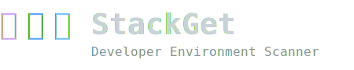

<p align="center">
  
</p>

<p align="center">
  <strong>Know exactly what's on your machine. Every tool. Every version.</strong>
</p>

<p align="center">
  <a href="https://github.com/sriram-ravichandran/stackget/actions/workflows/ci.yml">
    
  </a>
  <a href="https://github.com/sriram-ravichandran/stackget/releases/latest">
    
  </a>
  <a href="https://www.npmjs.com/package/stackget">
    
  </a>
  
  <a href="LICENSE">
    
  </a>
</p>

---

**StackGet** is a fast, zero-dependency CLI that scans your developer machine and reports every installed development tool — CLI utilities **and** desktop GUI applications — with their exact versions, organized into 22 categories.

```
  ⫸⫸⫸  StackGet
         Developer Environment Scanner

  Host: SRIRAM-PC              |  OS: Windows 11 (amd64)
  CPU:  13th Gen Intel Core i7 (20 cores)
  GPU:  NVIDIA GeForce RTX 4070
  ──────────────────────────────────────────────────────
  Scan: 28.4s  |  Tip: pass --all to show not-installed tools

  🌐  Languages
  ──────────────────────────────────────────────────────
    ●  Node.js                        20.17.0 (active), 18.20.4
    ●  Python 3                       3.11.9
    ●  Go                             1.26.1
    ●  Rust (rustc)                   1.77.0
    ●  Java                           21.0.2

  🐳  DevOps & Infrastructure
  ──────────────────────────────────────────────────────
    ●  Docker                         28.0.1
    ●  kubectl                        1.29.2
    ●  Terraform                      1.9.5
```

---

## Installation

### npm (recommended — works everywhere Node is installed)

```bash
npm install -g stackget
```

### Direct download

Download the binary for your platform from the [latest release](https://github.com/sriram-ravichandran/stackget/releases/latest):

| Platform       | Download |
|----------------|----------|
| Windows x64    | `stackget-windows-amd64.tar.gz` |
| macOS Intel    | `stackget-darwin-amd64.tar.gz`  |
| macOS Apple Silicon | `stackget-darwin-arm64.tar.gz` |
| Linux x64      | `stackget-linux-amd64.tar.gz`   |
| Linux ARM64    | `stackget-linux-arm64.tar.gz`   |

```bash
# Example: macOS Apple Silicon
curl -sL https://github.com/sriram-ravichandran/stackget/releases/latest/download/stackget-darwin-arm64.tar.gz | tar xz
sudo mv stackget /usr/local/bin/
```

### Build from source

```bash
git clone https://github.com/sriram-ravichandran/stackget
cd stackget
go build -o stackget .
```

---

## Commands

### `stackget scan`

Scan the current machine and display all installed tools.

```bash
stackget scan                     # Installed tools only (default)
stackget scan --all               # Include tools that are NOT installed
stackget scan --missing           # Show only what's missing
stackget scan --only languages    # Filter to one category (partial match)
stackget scan -o json             # Machine-readable JSON output
stackget scan -o yaml             # YAML output
stackget scan --no-color          # Plain text, no ANSI colour
```

### `stackget generate`

Save a full scan snapshot to a YAML file. Use this to capture your environment baseline.

```bash
stackget generate                        # Saves to stackget.yaml
stackget generate ~/envs/laptop.yaml     # Custom path
stackget generate -o json > env.json     # JSON format
```

### `stackget check`

Compare the current machine against a saved manifest. Exits `0` (PASS) or `1` (FAIL) — perfect for CI pipelines.

```bash
stackget check                           # Auto-discovers stackget.yaml in CWD
stackget check ci-baseline.yaml          # Explicit path
```

```
  🟢  Node.js        20.17.0    ✓ installed, version matches
  🟢  Docker         28.0.1     ✓ installed, version matches
  🔴  Python 3       not installed
  🔴  Go             required 1.21 — found 1.26

  ❌  FAIL — 2 of 4 requirements not met
```

### `stackget diff`

Side-by-side comparison of two saved snapshots. Highlights every version difference in colour.

```bash
stackget diff laptop.yaml desktop.yaml
stackget diff before.yaml after.yaml
stackget diff dev.yaml ci.yaml
```

### `stackget export`

Convert your scan results into another config format.

```bash
# Print devcontainer.json to stdout
stackget export --target devcontainer

# Write directly to the devcontainer config file
stackget export --target devcontainer --output .devcontainer/devcontainer.json
```

**Supported targets:**

| Target | Description |
|--------|-------------|
| `devcontainer` | `.devcontainer/devcontainer.json` with official Microsoft Dev Container features |

### `stackget update`

Fetch a tool registry overlay from a remote URL and merge it with the built-in definitions. The overlay is additive — new tools and categories are appended; existing ones can be overridden.

```bash
stackget update                                    # Fetch from default registry URL
stackget update --url https://example.com/reg.json
stackget update --url https://... --sha256 <hex>  # With checksum verification
```

The overlay is saved to `~/.stackget/registry.json` and loaded automatically on every scan. Delete this file to revert to the built-in list.

---

## What's Detected

22 categories, 400+ tools across CLI and GUI applications:

| Category | Example tools |
|----------|---------------|
| Languages | Node.js, Python 3, Go, Rust, Java, Ruby, .NET, PHP, Swift, Dart, Kotlin, Elixir, Scala… |
| Compilers & Build Tools | GCC, Clang, CMake, Make, Gradle, Maven, Bazel… |
| Package Managers | npm, pip, cargo, brew, apt, choco, winget… |
| Databases | PostgreSQL, MySQL, MongoDB, Redis, SQLite… |
| GUI Database Clients | pgAdmin 4, DBeaver, TablePlus, MongoDB Compass, MySQL Workbench… |
| DevOps & Infrastructure | Docker, Kubernetes, Terraform, Ansible, Helm, Vagrant… |
| CI/CD Tools | GitHub CLI, GitLab CLI, Jenkins, CircleCI, ArgoCD… |
| Cloud & Serverless | AWS CLI, Azure CLI, gcloud, Serverless Framework, Pulumi… |
| Security & Cryptography | OpenSSL, GPG, Vault, Trivy, Snyk, nmap… |
| Editors & IDEs | VS Code, IntelliJ, PyCharm, Vim, Neovim, Emacs… |
| And 12 more… | Terminal tools, API tools, ML/AI, Mobile, Game Dev, Blockchain… |

**GUI app detection** uses the native OS registry — no path guessing:
- **Windows** → Uninstall registry hives (HKLM + HKCU), including Electron per-user installs
- **macOS** → `/Applications` directory + Spotlight (`mdfind`) for apps in custom paths
- **Linux** → XDG `.desktop` files from all standard app directories

---

## CI/CD Integration

Add a `stackget check` step to any pipeline as a pre-build gate:

```yaml
# GitHub Actions
- name: Verify environment
  run: stackget check ci-baseline.yaml
```

```yaml
# GitLab CI
verify-env:
  script:
    - stackget check ci-baseline.yaml
```

Create the baseline on your reference machine:
```bash
stackget generate ci-baseline.yaml
git add ci-baseline.yaml
git commit -m "chore: add CI environment baseline"
```

---

## Machine-readable output

```bash
# Full JSON dump — pipe to jq, use in scripts
stackget scan -o json | jq '.categories[] | select(.name == "Languages") | .tools[] | select(.installed)'

# YAML — save or diff with standard tools
stackget scan -o yaml > current.yaml
diff current.yaml baseline.yaml
```

---

## Overlay Registry

The `--update` command uses an overlay format. You can maintain your own private registry for custom or internal tools:

```json
{
  "version": "1",
  "categories": [
    {
      "name": "Internal Tools",
      "emoji": "🏢",
      "tools": [
        {
          "name": "my-deploy-tool",
          "commands": ["deploy"],
          "version_args": ["--version"]
        }
      ]
    }
  ]
}
```

Host this file anywhere (GitHub raw, S3, internal server) and point `stackget update --url` at it.

---

## License

MIT © [Sriram Ravichandran](https://github.com/sriram-ravichandran)
